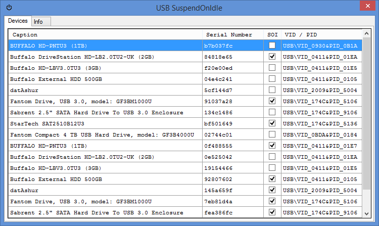
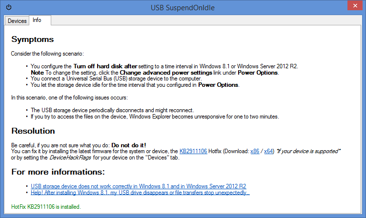

# USB SuspendOnIdle
Simple *DeviceHackFlags* Workaround Tool for USB storage devices

__Problems with Windows 8.1 and Windows Server 2012 R2’s power safe option__  
Some USB storage devices do not work correctly when using the power safe option. Devices that have not been used for a certain time suspend on idle. If you then try to access the files on the device, Windows Explorer becomes unresponsive for one to two minutes or the device does not restart properly and will be ejected and reinitialized. 

You can fix this by installing the latest firmware for your system or device, the KB2911106 Hotfix (Download: x86 / x64) _\*if your device is supported\*_, or by setting the _DeviceHackFlags_ for your device on the "Devices" tab. You just have to uncheck the box for your device in the "SOI" (SuspendOnIdle) column.

__For more informations:__  
* [USB storage device does not work correctly in Windows 8.1 and in Windows Server 2012 R2](http://support.microsoft.com/kb/2914219/en-us)
* [Help! After installing Windows 8.1, my USB drive disappears or file transfers stop unexpectedly…](http://blogs.msdn.com/b/usbcoreblog/archive/2013/11/01/help-after-installing-windows-8-1-my-usb-drive-disappears-or-file-transfers-stop-unexpectedly-r-a-post-title.aspx)

## Screens

## Requirements
* [.Net Framework 4](http://www.microsoft.com/de-de/download/details.aspx?id=17718)
* [HtmlRenderer](https://github.com/ArthurHub/HTML-Renderer)

## General
Name: USB SuspendOnIdle  
Description: Simple DeviceHackFlags Workaround Tool for USB storage devices  
Version: 1.0  
Author: Oliver Haucke  
Author URI: http://gadean.de/  
E-Mail: ohaucke@gadean.de  
License: BSD 2-Clause  
License URI: http://opensource.org/licenses/BSD-2-Clause
